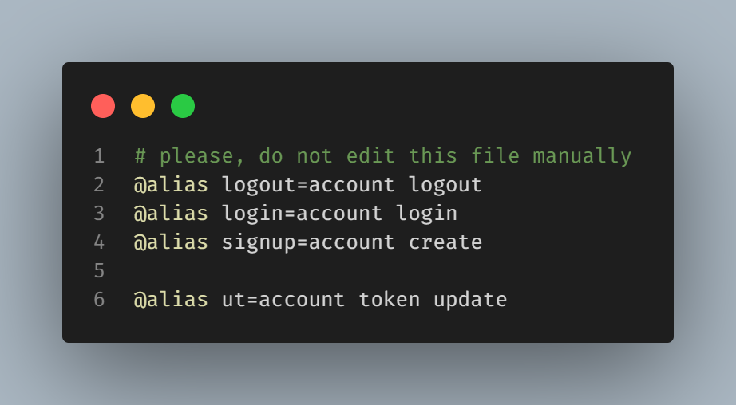

<h1 align="center">gRPC Todo List CLI</h1>

<br />
<br />

<div align="center">
  <i>
    Your todo list as a command line application!
  </i>
</div>

<br />
<br />

<div align="center">
  
  [](https://github.com/marcos-venicius/grpc-todo-list-cli/actions/workflows/test-server.yml)
  
</div>

<div align="center">
  
</div>

## Demonstration 

[](https://www.youtube.com/watch?v=fMegmXOOVV0)

A simple grpc todo list on live. your todo list as CLI.

create, list, complete, uncomplete, your tasks in your terminal and more...

## How to run on your machine?

- you need to install [.NET 7](https://dotnet.microsoft.com/en-us/download/dotnet/7.0)
- you need to have [Docker](https://www.docker.com/) installed (latest version)

build project to generate the proto files as c# classes

```bash
dotnet build
```

up all docker containers

```bash
docker compose up -d
```

run the server to accept the connections

```bash
cd GrpcTodo.Server
```

```bash
dotnet run -lp https
```

## Proto VSCode Extension help

settings.json

```json
{
  "protoc": {
    "options": ["--proto_path=GrpcTodo.SharedKernel/Protos"]
  }
}
```

## How to server tests?

- run script [test-server.win.ps1](./test-server.win.ps1) for windows **(tested)**
- run script [test-server.unix](./test-server.unix) for unix **(not tested)**

in any of this scripts if you want to run specific class tests.

just add the class test name after the script name

## Available CLI commands

Now the CLI creates some default `aliases`

- `logout` alias to: `account logout`
- `login` alias to: `account login`
- `signup` alias to: `account create`

you can add your own aliases on config file manually

to create a new aliase go to `C:\Users\<your_user>\.gl\configs`

add a new alias to update your token for example:

```shell
@alias ut=account token update
```

your config file should be like:



now in your CLI you have this alias enabled, use:

```shell
gl ut
```

this alias will execute the `account token update` command.

to see all available commands type:

```shell
gl --help
```


- account
  - create `create new account`
  - login `make login`
  - logout `make logout. signout from your account`
  - token
    - update `hard update your auth token. generate a new one`
- alias
  - create `create new alias`
  - remove `remove an existing alias`
  - list `list all available aliases`
- task
  - create `create a new task`
  - complete `complete a task`
  - uncomplete `uncomplete a task`
  - list `list all tasks`
  - delete `delete a task`

**if a command is green, this are implemented. if is red, are not**

## How to use the CLI in DEV

```bash
cd ./GrpcTodo.CLI
```

```bash
dotnet run <command>
```
