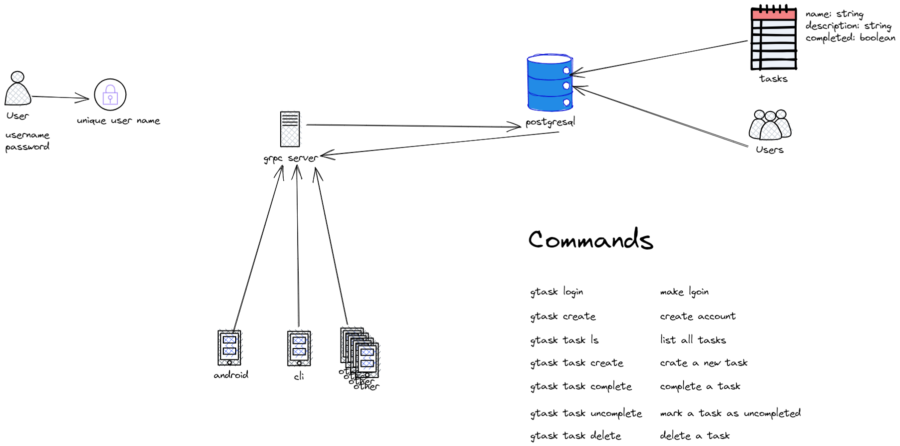
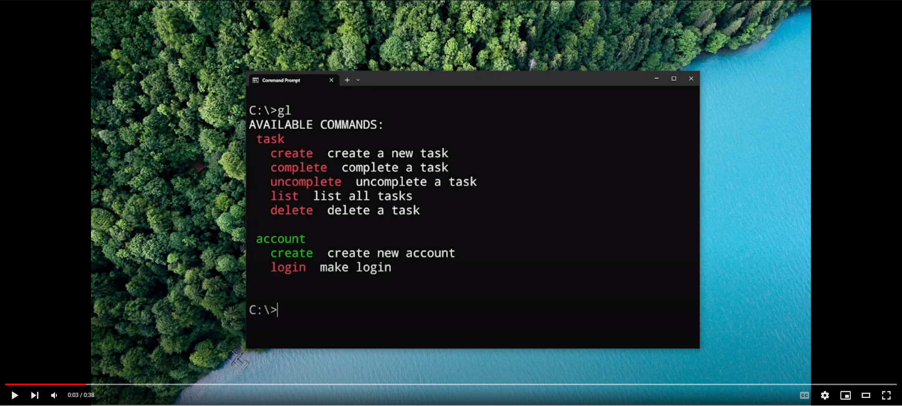
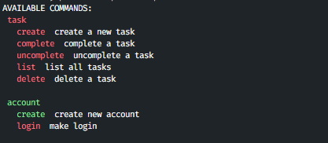

# Todo list as CLI

<div align="center">
  
</div>

## Demo

[](https://www.youtube.com/watch?v=fMegmXOOVV0)

A simple grpc todo list on live. your todo list as CLI.

create, list, complete, uncomplete, your tasks in your terminal and more...

## How to run on your machine?

- you need to install [.NET 7](https://dotnet.microsoft.com/en-us/download/dotnet/7.0)
- you need to have [Docker](https://www.docker.com/) installed (latest version)

build project to generate the proto files as c# classes

```bash
dotnet build
```

up all docker containers

```bash
docker compose up -d
```

run the server to accept the connections

```bash
cd GrpcTodo.Server
```

```bash
dotnet run -lp https
```

## Proto VSCode Extension help

settings.json

```json
{
  "protoc": {
    "options": ["--proto_path=GrpcTodo.SharedKernel/Protos"]
  }
}
```

## How to server tests?

- run script [test-server.win.ps1](./test-server.win.ps1) for windows **(tested)**
- run script [test-server.unix](./test-server.unix) for unix **(not tested)**

in any of this scripts if you want to run specific class tests.

just add the class test name after the script name

## Available CLI commands



- account
  - create `create new account`
  - login `make login`
- task
  - create `create a new task`
  - complete `complete a task`
  - uncomplete `uncomplete a task`
  - list `list all tasks`
  - delete `delete a task`

**if a command is green, this are implemented. if is red, are not**

## How to use the CLI in DEV

```bash
cd ./GrpcTodo.CLI
```

```bash
dotnet run <command>
```
